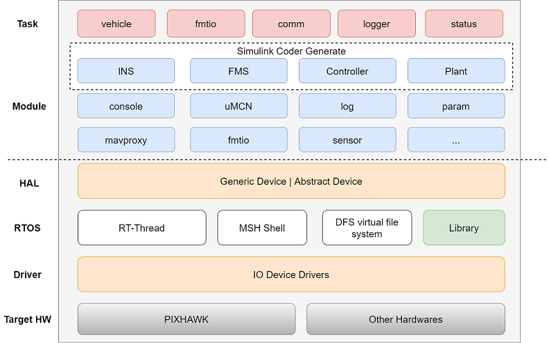

# FMT 固件
FMT Firmware 是用 C 语言编写的飞控嵌入式代码。是一款轻量级且功能强大嵌入式飞控系统。高度模块化的结构设计，可以被方便地移植到不同的硬件平台。

FMT Firmware 基于 Pixhawk (FMUv2) 的硬件平台进行开发，未来将移植到更多硬件平台上。Pixhawk 包括主核 (stm32F427) 和 从核 (stm32F103) ， 分别对应 FMU 和 IO 两个部分的固件。FMT 支持Mavlink 1.0/2.0，所以可以支持主流的地面站，如QGC，Mission Planner 等。

## FMT Firmware架构
FMT Firmware 为飞控的嵌入式部分，采用**分层设计模式**，层与层，模块与模块之间松耦合，易于单独添加/删除模各个模块。 FMT Firmware 架构如下图所示。

它具体包括以下部分：

- 内核层 (RTOS): 内核层采用实时操作系统 RT-Thread,提供了例如多线程及其调度、信号量、邮箱、消息队列、内存管理、定时器等；DFS 是 RT-Thread 提供的虚拟文件系统组件，提供标准POSIX接口。
- 驱动层 (Driver): 驱动层提供硬件驱动支持，如IMU, GPS, 磁力计，气压计，SD卡，USB以及通信总线，如I2C，SPI，DMA等。
- 硬件抽象层 (HAL)： HAL为上层提供统一的read/write/control设备接口。便于添加新的驱动设备或者移植到不同硬件平台上。同时可以将与硬件无关的驱动逻辑放在HAL层实现，简化了驱动的开发难度。
- 模块层 (Module)：模块层提供FMT系统的大部分功能。比如基于发布/订阅模式的跨进程通信机制uMCN。日志模块提供了二进制日志，文字日志和开机日志的功能。参数模块提供强大的参数功能，支持命令行/地面站在线调参。并且参数也将保存到日志中，供仿真模型读取。其中 **INS**, **FMS**, **Controller** 和 **Plant** 为 Simulink 生成的算法模块。
- 任务层 (Task)： 每个Task为一个单独的线程 (内部可以创建子线程) 实现独立的功能。比如`vehicle`任务将周期性执行INS，FMS和Controller，以实现被控对象的控制。
