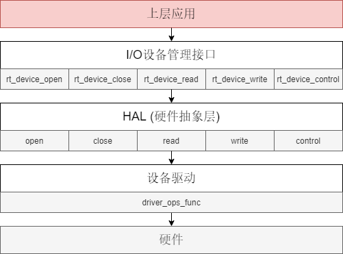
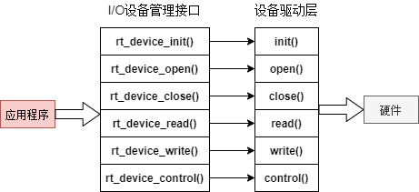
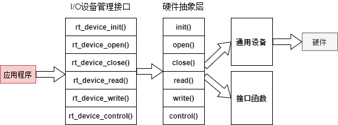

# 设备和驱动
对于不同的嵌入式平台都包括一些 I/O (Input/Output, 输入/输出) 设备，例如飞控硬件平台上的串口通信、惯性传感原件、USB 以及 SD 卡等。这些设备为上层应用提供相关硬件的 I/O 功能。

本章主要介绍 Firmament 的 I/O 设备和驱动框架，包括如何访问 I/O 设备以及如何向 Firmament 系统中添加新的I/O设备或者驱动。

## 设备和驱动框架
Firmament 的 I/O 设备模型框架如下图所示。它位于硬件和上层应用之间，共分成三层，从上到下分别是 I/O 设备管理层、硬件抽象层 (HAL)和设备驱动层。



上层应用通过 I/O 设备管理接口获得正确的设备句柄，然后通过这个设备句柄来与对应的设备进行数据（或控制）交互。

I/O 设备管理层为 RT-Thread 提供的[设备访问接口](https://www.rt-thread.org/document/site/programming-manual/device/device/)。上层应用通过 I/O 设备层提供的标准接口访问底层设备。这里的底层设备既可以是**通用设备**、**普通设备**或者**虚拟设备**。

硬件抽象层是对平台通用设备驱动的抽象，目的是为不同型号的硬件设备提供统一的 API 接口。将与硬件无关的驱动逻辑放在该层实现，从而简化驱动开发的难度。同时，这种方式使得设备的硬件操作相关的代码能够独立于上层而存在，更换/升级设备驱动程序的升级或者移植到其它硬件平台更将不会对上层应用产生影响，从而降低了代码的耦合性、复杂性，提高了系统的可靠性和可移植性。

设备驱动层提供硬件设备的驱动程序，与硬件直接打交道。驱动设备要能够被上层应用使用，首先需要将自己注册为通用设备或者普通设备。

## 通用设备
通用设备是指包含了硬件抽象层和设备驱动层的 I/O 设备, 其一般为各硬件平台所共有的硬件设备。对于 Pixhawk 来说，通用设备一般包括串口、PIN、I2C、SPI、USB、SD 卡、电机、RC、ADC、加速度计、陀螺仪、磁力计、GPS 、气压计、定时器和系统时钟等。

通用设备由底层驱动程序进行注册，然后在抽象层中再注册为系统设备。通用设备的操作方法的映射关系如下图所示：


其中 **driver_ops** 为硬件抽象层定义的各个设备驱动的功能函数 (operation functions)。 驱动程序需要实现对应的功能函数，并将其注册为对应的通用设备。

## 普通设备
普通设备是指不包含硬件抽象层，由驱动层直接向系统注册为系统设备。普通设备没有与之对应的硬件抽象层的通用设备，所以普通设备一般用于某个嵌入式平台所特有的硬件，比如 Pixhawk 上的三色 LED 灯。普通设备的操作方法的映射关系如下图所示：



## 虚拟设备
虚拟设备是一种比较特殊的设备，具有很大的灵活性。合理利用好虚拟设备，可以大大优化系统架构并简化上层应用的开发复杂度。

不同于通用设备和普通设备，虚拟设备构建于通用设备或者其它模块提供的接口函数之上。 虚拟设备的操作方法的映射关系如下图所示：



Firmament 中包含了许多的虚拟设备，比如`mav_console`设备提供了将控制台消息封装为 mavlink 协议包进行发送的功能。mav_console 在 HAL 层将数据封装为 mavlink 数据包（`MAVLINK_MSG_ID_SERIAL_CONTROL`）， 然后通过 `serial` 或者 `usb` 设备进行数据发送。

## 访问 I/O 设备

当设备被注册到系统后，上层应用就可以通过 I/O 设备管理接口来访问该设备（通用设备，普通设备或者虚拟设备）。

首先通过设备名称来获取设备句柄，进而可以操作设备。查找设备函数如下所示：

```c
rt_device_t rt_device_find(const char* name);
```

获得设备设备句柄后，可以打开和关闭设备。打开设备时，会检测设备是否已经初始化，没有初始化则会默认调用初始化接口初始化设备。通过如下函数打开设备：

```c
rt_err_t rt_device_open(rt_device_t dev, rt_uint16_t oflags);
```

上层应用打开设备完成读写等操作后，如果不需要再对设备进行操作则可以关闭设备，进而释放设备资源。通过如下函数完成：

```c
rt_err_t rt_device_close(rt_device_t dev);
```

从设备中读/写数据可以通过如下函数完成：

```c
rt_size_t rt_device_read(rt_device_t dev, rt_off_t pos,void* buffer, rt_size_t size);
rt_size_t rt_device_write(rt_device_t dev, rt_off_t pos,const void* buffer, rt_size_t size);
```
其中`pos` 根据不同的设备有不同的意义，具体含义请查看对应设备的头文件定义。

通过设备控制函数，上层可以对设备进行控制，通过如下函数完成：

```c
rt_err_t rt_device_control(rt_device_t dev, rt_uint8_t cmd, void* arg);
```
其中`cmd` 根据不同的设备有不同的意义，具体含义请查看对应设备的头文件定义。

## 添加 I/O 设备

要添加一个 I/O 设备到 Firmament中，首先要考虑要添加设备的类型，是通用设备、普通设备还是虚拟设备？不同设备的添加方式会略有不同。这里以添加一个加速度计来演示如何添加设备到系统中。

因为加速度计设备为各个飞控平台共有的设备，所以可以确定其为通用设备。Firmament 已经实现了加速度计硬件抽象层的逻辑 (如果没有则需要自己实现)，所有只需要提供一个驱动程序，并实现 `accel.h` 中所定义的 `driver_ops` 驱动功能函数，然后注册为 `accel` 通用设备即可完成设备的添加。

加速度计的驱动功能函数定义如下：

```c
/* accel driver opeations */
struct accel_ops {
    rt_err_t (*accel_config)(accel_dev_t accel, const struct accel_configure* cfg);
    rt_err_t (*accel_control)(accel_dev_t accel, int cmd, void* arg);
    rt_size_t (*accel_read)(accel_dev_t accel, rt_off_t pos, void* data, rt_size_t size);
};
```

驱动首先需要实现 `accel_config` 函数来配置加速度计的参数，其中 `accel_configure` 中配置参数如下：

```c
struct accel_configure {
    rt_uint32_t sample_rate_hz;
    rt_uint16_t dlpf_freq_hz;
    rt_uint32_t acc_range_g;
};
```

其中 `sample_rate_hz` 为采样频率，`dlpf_freq_hz` 为硬件低通滤波截至频率，`acc_range_g` 为加速度的测量范围 。`mpu6000.c` 中的配置函数实现如下：

```c
static rt_err_t accel_config(accel_dev_t accel, const struct accel_configure* cfg)
{
    rt_err_t ret = RT_EOK;

    if (cfg == RT_NULL) {
        return RT_EINVAL;
    }

    ret |= _set_accel_range(cfg->acc_range_g);

    ret |= _set_sample_rate(cfg->sample_rate_hz);

    ret |= _set_dlpf_filter(cfg->dlpf_freq_hz);

    accel->config = *cfg;

    return ret;
}
```

第二个要实现的函数是 `accel_control`，该函数可以用来给驱动设备传输一些指令。目前 `accel` 还没有定义相关的指令，所以驱动函数直接返回成功即可:

```c
static rt_err_t accel_control(accel_dev_t accel, int cmd, void* arg)
{
    return RT_EOK;
}
```

最后一个要实现的函数是 `accel_read`，该函数其用来读取加速度计的数据。这里的定义 `pos` 有两个，分别为读取加速度计原始数据和标准化单位 ( m/s<sup>2</sup> ) 数据。

```c
/* accel read pos */
#define ACCEL_RD_RAW 1
#define ACCEL_RD_SCALE 2
```

`mpu6000` 的读取加速度计数据函数实现如下：

```c
static rt_size_t accel_read(accel_dev_t accel, rt_off_t pos, void* data, rt_size_t size)
{
    if (data == RT_NULL) {
        return 0;
    }

    if (pos == ACCEL_RD_RAW) {
        if (mpu6000_acc_read_raw(((int16_t*)data)) != RT_EOK) {
            return 0;
        }
    } else if (pos == ACCEL_RD_SCALE) {
        if (mpu6000_acc_read_m_s2(((float*)data)) != RT_EOK) {
            return 0;
        }
    } else {
        DRV_DBG("accel unknow read pos:%d\n", pos);
        return 0;
    }

    return size;
}
```

驱动的功能函数实现后，在驱动的初始化函数中调用 `hal_accel_register` 函数将自己注册为`accel`设备：

```c
rt_err_t mpu6000_drv_init(char* spi_device_name)
{
    rt_err_t ret = RT_EOK;
    static struct accel_device accel_dev = {
        .ops = &_accel_ops,
        .config = ACCEL_CONFIG_DEFAULT,
        .bus_type = GYRO_SPI_BUS_TYPE
    };
    static struct gyro_device gyro_dev = {
        .ops = &_gyro_ops,
        .config = GYRO_CONFIG_DEFAULT,
        .bus_type = GYRO_SPI_BUS_TYPE
    };

    spi_device = rt_device_find(spi_device_name);

    if (spi_device == RT_NULL) {
        DRV_DBG("spi device %s not found!\r\n", spi_device_name);
        return RT_EEMPTY;
    }

    /* config spi */
    {
        struct rt_spi_configuration cfg;
        cfg.data_width = 8;
        cfg.mode = RT_SPI_MODE_3 | RT_SPI_MSB; /* SPI Compatible Modes 3 */
        cfg.max_hz = 3000000;

        struct rt_spi_device* spi_device_t = (struct rt_spi_device*)spi_device;

        spi_device_t->config.data_width = cfg.data_width;
        spi_device_t->config.mode = cfg.mode & RT_SPI_MODE_MASK;
        spi_device_t->config.max_hz = cfg.max_hz;
        ret |= rt_spi_configure(spi_device_t, &cfg);
    }

    /* driver internal init */
    ret |= _init();

    /* register gyro hal device */
    ret |= hal_gyro_register(&gyro_dev, "gyro0", RT_DEVICE_FLAG_RDWR, RT_NULL);

    /* register accel hal device */
    ret |= hal_accel_register(&accel_dev, "accel0", RT_DEVICE_FLAG_RDWR, RT_NULL);

    return ret;
}
```

其中 `accel0` 为设备名称，上层应用通过该名称来获取设备句柄。`mpu6000` 包括一个陀螺仪和一个加速度计，所以这里除了注册加速度计设备外，还注册了一个陀螺仪设备。

> 注意：Firmament 默认使用 `gyro0` 和 `accel0` 作为系统的主 IMU，`gyro1` 和 `accel1` 作为副 IMU。 所以如果要使用某个 IMU 设备作为主 IMU，将其注册为 `gyro0` 和 `accel0` 即可。