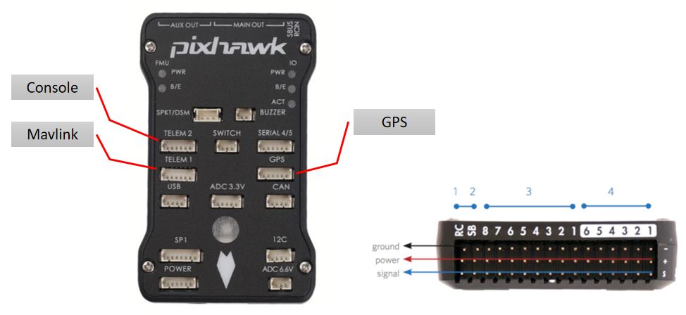

# 快速上手

## 硬件连接


硬件连接如图所示:

- `TELEM 2`: 默认作为控制台**Console**的输出，默认波特率*57600*。
- `TELEM 1`: 默认作为**Mavlink**的输出口，默认波特率*57600*。
- `GPS`: 连接GPS模块，默认波特率*9600*。
- `RC`: 连接遥控器的*PPM*/*SBUS*信号,目前最多支持8路PPM信号/16路SBUS信号。
- `SB`: SBUS信号输出口。
- `MAIN OUT`: 支持最多8路PWM输出信号 (可改为捕获输入信号)。
- `AUX OUT`: 支持最多6路PWM输出信号 (可改为捕获输入信号)。
- `其它`：TBA。

## 编译环境
支持在Windows/Linux/Mac环境下编译，需要用到的工具链如下：

- **编译器**: [*arm-none-eabi- toolchain*](https://developer.arm.com/tools-and-software/open-source-software/developer-tools/gnu-toolchain/gnu-rm/downloads) (推荐版本: `7-2018-q2-update`，其它版本未测试)
- **编译工具**：[*Scons*](https://sourceforge.net/projects/scons/files/scons/2.3.6/) (推荐版本：`v2.3.6`)，同时*Scons*需要用到*python2.7.x*
- **编辑器**：推荐*VS Code*。使用*VS Code*打开`FMT_Firmware/fmt_fmu`或者`FMT_Firmware/fmt_io`目录即可打开项目工程。
- **USB驱动**：下载 [STM32 USB驱动](https://www.st.com/en/development-tools/stsw-stm32102.html) (Only for Windows)

## 编译固件
在配置好了编译环境后，首先需要配置`RTT_EXEC_PATH`的环境变量。将其值设置为编译器的地址，如

```
*Windows*:
System Property->Advanced->Environment Variables
Add RTT_EXEC_PATH and set to  $arm-none-eabi-7-2018-q2-update/bin

*Linux*:
export RTT_EXEC_PATH=$arm-none-eabi-7-2018-q2-update/bin
```

在命令行窗口中输入`scons --version`和`python --version`查看版本是否正常。完成以上步骤后，可以开始编译FMT固件。

### 编译**FMT FMU**固件
```
cd FMT_Firmware/fmt_fmu/target/pixhawk
scons -j4
```
编译完成后，固件`fmt_fmu.bin`将生成在*build*目录下。

### 编译**FMT IO**固件
```
cd FMT_Firmware/fmt_io/project
scons -j4
```
编译完成后，固件`fmt_io.bin`将生成在*build*目录下。

## 固件下载
FMT 包含 FMU (Flight Management Uinit) 固件和 IO (Input/Output) 固件，需要分别进行下载 (Pixhawk V2 包含两个 CPU) 。FMT 使用 Pixhawk 内置的 bootloader 进行固件的下载，所以在下载了FMT的固件后也能随时刷回PX4/APM的固件。

### 下载FMT FMU固件
目前有两种方式下载FMU固件: 通过*uploader.py*脚本下载或者通过*QGC*地面站下载。

- **uploader.py脚本：**
在`fmt_fmu/target/pixhawk`目录下执行`python uploader.py`，然后将飞控通过usb连接至PC。脚本将自动检测FMU的端口开始下载位于*build*目录下的`fmt_fmu.bin`固件。如果脚本提示找不到端口，可以尝试重复以上步骤或者检查是否有正确安装usb驱动。

- **QGC地面站：**
进入*Firmware Setup*页面，然后使用usb线连接飞控和PC。这时会弹出选择固件的界面，选择`Advanced Settings`->`Custom firmware file`，然后选择`fmt_fmu.bin`固件即可开始下载。


固件下载成功后，可以使用串口(**TELEM 2, baudrate: 57600**)，QGC的**Mavlink Console**或者**mavlink_shell.py**脚本连接控制台，如下图所示为飞控开机打印的信息，这里显示了系统的信息，如固件版本，内核版本和模型版本等。

```
   _____                               __
  / __(_)_____ _  ___ ___ _  ___ ___  / /_
 / _// / __/  ' \/ _ `/  ' \/ -_) _ \/ __/
/_/ /_/_/ /_/_/_/\_,_/_/_/_/\__/_//_/\__/
Firmware....................FMT FMU v0.1.3
Kernel....................RT-Thread v3.0.5
RAM.................................192 KB
Board..............................Pixhawk
Vehicle.........................Quadcopter
INS Model..................Base INS v0.1.0
FMS Model..................Base FMS v0.1.0
Control Model.......Base Controller v0.1.0
Task Initialize:
  vehicle...............................OK
  fmtio.................................OK
  comm..................................OK
  logger................................OK
  status................................OK

msh />
```

### 下载FMT IO固件
协处理器的IO固件需通过FMU进行下载，所以在下载IO固件之前需确保FMU已经正常运行起来。

首先将IO固件`fmt_io.bin`放到sd卡上。FMT支持FTP功能，故可以通过QGC (3.5.6, 最新的QGC上已经不支持FTP的功能) 进行文件上传 (*Widget->Onboard Files*)，当然也可以使用SD读卡器进行文件拷贝。

固件上传后，进入控制台输入如下指令:
```
fmtio upload $path/fmt_io.bin
```
其中`$path`为存放*fmt_io.bin*的路径，如果是放在当前目录，则可以省略，直接输入`fmtio upload`即可。

>  注意：因为PX4的IO固件不识别FMT的重启指令，所以在第一次下载FMT IO固件时，在输入`fmtio upload`指令后，需要手动按下位于**Pixhawk**右侧的IO复位按钮，使得IO复位并进入bootloader程序。

下载完成后，在控制台输入`fmtio hello`指令，如果IO固件更新成功，应该看到IO发来的如下消息：

```shell
msh />fmtio hello
msh />[IO]:Hello, this is FMT IO!
```

### 上传默认系统配置文件
默认系统配置文件放在 `fmt_fmu/target/pixhawk/sysconfig.toml`，里面定义了各个模块的配置信息。

如 *[pilot-cmd]* 定义了遥控相关的配置，默认是使用ppm协议，6通道rc数据。如果您遥控的设置跟这里配置不一致，则需要进行对应修改。

使用 QGC 的 *Widget->Onboard Files* 或者读卡器将`sysconfig.toml`上传到sd卡的`/sys`目录下，重启飞控即可。

### 刷回PX4固件
首先同样利用**QGC**地面站下载PX4/APM的固件到FMU。 PX4在上电会检查IO的固件版本并进行更新。但是由于目前FMT IO还不识别PX4的重启指令，故无法重启进入bootloader模式，所以需要手动进行IO固件的下载，目前有两种方法：

1. 按住安全开关 (safety switch)， 然后给飞控上电，这时候IO将会停留在bootloader中，这时候再按照之前的步骤刷新PX4/APM的固件到FMU。当FMU固件更新成功后，IO固件也将自动进行更新。
2. 在刷了FMU固件后，进入nsh的控制台，输入指令`px4io forceupdate 14662 /etc/extras/px4_io-v2_default.bin`，在输入完指令后，立马按下IO的复位键，则可以开始IO固件的烧写。

## 代码调试
FMT提供了丰富的调试手段，常用的比如通过console打印，log日志记录以及jtag连接进行单独调试。

### Console打印
在FMU中可以调用`console_printf()`函数进行打印，用法类似`printf()`。信息将被打印显示在*console*设备上，支持中断上下文中打印。

### ULOG日志
ULOG 为rt-thread提供的文字日志系统，支持不同level等级的日志信息输出，比如*Error*,*Warning*,*Info*,*Debug*等，对应的函数接口为：
```
ulog_e(TAG, ...)	// Error
ulog_w(TAG, ...)	// Warning
ulog_i(TAG, ...)	// Info
ulog_d(TAG, ...)	// Debug
```
FMT支持将ulog日志输出到多个后端，比如*console*和*file system*。比如这条代码
```
ulog_e("Test", "Hello, this is %s", "FMT");
```
将在*console*打印如下信息，并且这条信息将被记录到`log/session_x/ulog.txt`中
```
[1770] E/Test: Hello, this is FMT
```

### BLOG日志
BLOG 日志提供二进制数据记录的功能。比如可以用来记录算法模型的输入输出数据，然后导入 Matlab/Simulink 中进行数据查看。具体使用请参照 BLOG 章节介绍。

### JTAG调试
TO BE ADD
