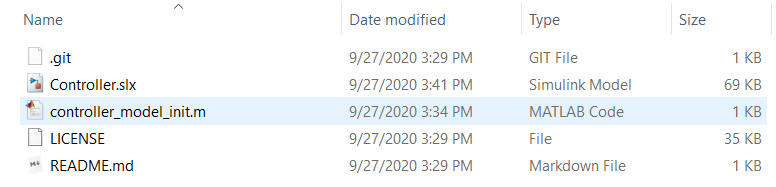
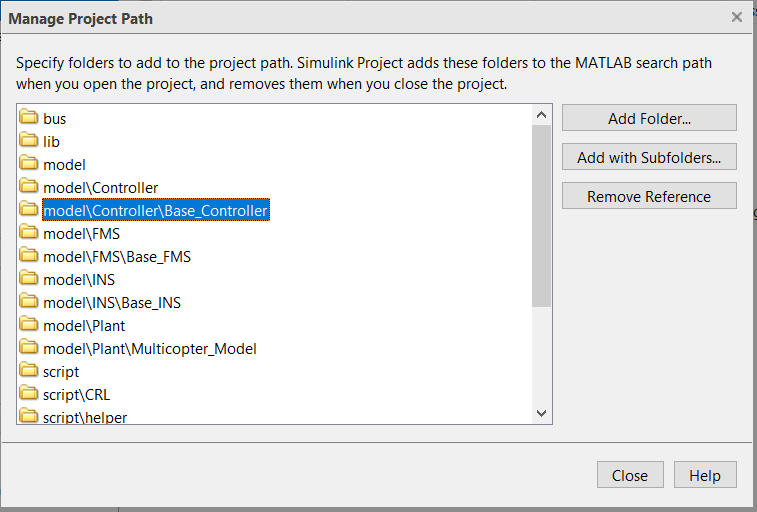

# 模型二次开发
基于 FMT Model 的框架可以很方便地开发新的模型，或者基于已有的模型进行二次开发。

目前有两种方式。第一种是基于一个已有模型进行修改，比如复制`Base_Controller/`中的内容并更名为`My_Controller/`，然后修改My_Controller目录下的模型和初始化脚本文件。第二种方式为基于模板模型开发新的模型。下面以第二种方式为例介绍如何创建新的模型并添加到 FMT Model 中。第一种方式类似修改。

## 创建新模型
这里以控制器为例，说明如何基于控制器模板模型创建新的模型并加入 FMT Model 中。

- 首先复制`Template_Controller/`并重新命名，这里命名尽量跟控制器的实际用途或者算法名称相匹配。比如开发固定翼的控制器，则可以命名为`Fixwing_Controller/`。
- Fixwing_Controller目录包含如下文件，其中`controller_model_init.m`为模型初始化文件，将被 FMT Model 的初始化脚本调用。`Controller.slx`为控制器的模型文件。控制器模板模型只包含了控制器的基本框架，还有一些逻辑控制等。控制器的具体设计则预留出来供用户自行设计。



- `controller_model_init.m`文件内容如下所示。

```matlab
% 
% This is a template controller model
% Firmament Autopilot
%

controller_version = 'v0.0.1';

%% Constant Variable
CONTROL_CONST.dt = 0.005;   % model execution period, change accordingly

%% Exported Value
CONTROL_EXPORT_VALUE.period = uint32(CONTROL_CONST.dt*1e3);
CONTROL_EXPORT_VALUE.model_info = int8(['Template Controller ', controller_version, 0]); % 0 for end of string

%% Paramaters
CONTROL_PARAM_VALUE.A = single(1.0);    % add your own parameters
CONTROL_PARAM_VALUE.B = int16(0); % add your own parameters

%% Export to firmware
CONTROL_EXPORT = Simulink.Parameter(CONTROL_EXPORT_VALUE);
CONTROL_EXPORT.CoderInfo.StorageClass = 'ExportedGlobal';
CONTROL_PARAM = Simulink.Parameter(CONTROL_PARAM_VALUE);
CONTROL_PARAM.CoderInfo.StorageClass = 'ExportedGlobal';
```

- `controller_version`表示模型的版本号，每次修改模型后需要更新模型的版本号。`CONTROL_CONST.dt`表示模型的运行周期，比如我们需要让控制器模型以500Hz运行，则设置`CONTROL_CONST.dt=0.002` （目前 FMT 支持的模型最大运行频率为 1KHz）。
- `CONTROL_EXPORT_VALUE`为输出给 FMS Firmware 读取的模型信息数据，其中 `CONTROL_EXPORT_VALUE.period`为模型的运行周期，单位ms，该值会根据CONTROL_CONST.dt来计算，所以无需修改。`CONTROL_EXPORT_VALUE.model_info`为模型信息，将被打印在 FMT Firmware 的开机信息中，这里我们可以对应修改为`Fixwing Controller`。
- `CONTROL_PARAM_VALUE`为模型的输入参数信息，可以为模型定义输入参数。FMT Firmware 可以管理参数并将参数传递给模型。比如这里我们仅定义一个 PID 的控制参数。
- 最终`Fixwing_Controller`的初始化脚本配置如下：

```matlab
controller_version = 'v0.0.1';

%% Constant Variable
CONTROL_CONST.dt = 0.002;   % model execution period, change accordingly

%% Exported Value
CONTROL_EXPORT_VALUE.period = uint32(CONTROL_CONST.dt*1e3);
CONTROL_EXPORT_VALUE.model_info = int8(['Fixwing Controller ', controller_version, 0]); % 0 for end of string

%% Paramaters
CONTROL_PARAM_VALUE.KP = single(1.0);    
CONTROL_PARAM_VALUE.KI = single(0.1); 
CONTROL_PARAM_VALUE.KD = single(0.1); 

%% Export to firmware
CONTROL_EXPORT = Simulink.Parameter(CONTROL_EXPORT_VALUE);
CONTROL_EXPORT.CoderInfo.StorageClass = 'ExportedGlobal';
CONTROL_PARAM = Simulink.Parameter(CONTROL_PARAM_VALUE);
CONTROL_PARAM.CoderInfo.StorageClass = 'ExportedGlobal';
```

## 添加新模型
在完成模型的创建和脚本配置后，下一步就可以将我们新的模型添加到 FMT Model 中。具体步骤如下：

- 将新模型放到`$FMT_Model/model/Controller`目录下 （比如`$FMT_Model/model/Controller/Fixwing_Controller`）
- 打开 $FMT_Model/FMT_Model.prj，然后点击`Project Path`
- 将新添加模型目录添加到工程目录中，并把当前使用的控制器（如`$FMT_Model/model/Controller/Base_Controller`）从工程目录中删除，因为 FMT Model 同一时间只能使能一个控制器模型。工程路径设置窗口如下图所示：



- 恭喜，至此就完成了新模型的创建添加！