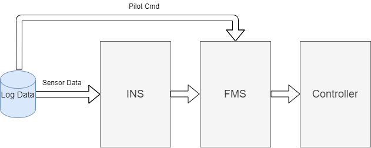
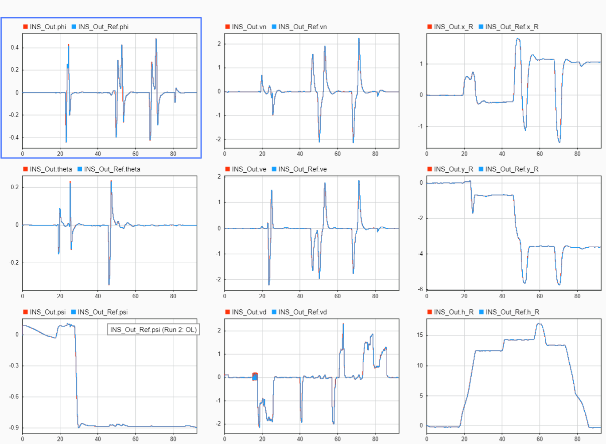
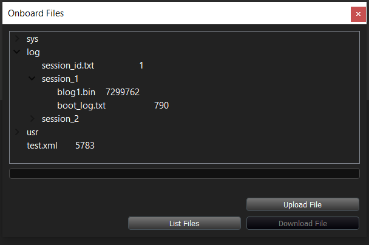
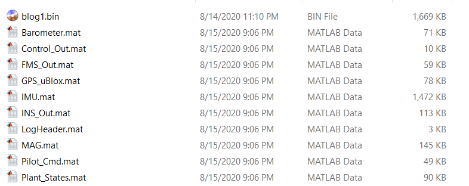

# 开环仿真

开环仿真是 MBD 开发模式的一个“杀手锏”功能，通过记录少量的模型输入数据，就可以完全复现算法模型在真实测试中的表现，为算法模型的调试与优化提供了一种非常高效的途径。

大部分客机，军机上都配有黑匣子，用来记录飞行数据。当发生空难时，整个事故过程中的飞行参数就能从黑匣子中找到，人们便可知道飞机失事的原因。FMT 也提供了类似黑匣子的功能，即 BLog 日志模块。只需记录少量的模型输入数据，即可通过开环仿真完全复现当时的飞行场景，**获取所有模型的输出以及内部任意状态信息，并且仿真的数据和实际飞行的数据 100% 吻合**。 FMT 的开环仿真模型结构如下图：



开环仿真的结果跟实际的结果完全吻合，这得益于 FMT 飞控系统优秀的实时性和高效的性能。如下图所示为一组导航的输出，红色为开环仿真的结果 (500Hz)，蓝色为记录的导航实际输出的结果 (100Hz频率记录)。两者完全拟合（图中不拟合的部分是由于记录实际模型输出的频率低于实际模型的运行频率）。其它模型也可以获得同样的仿真效果。



## 运行开环仿真

- 将 `BLOG_MODE` 参数设置为`2`或者`3`，重启飞控将从开机记录 blog。由于算法模型是从开机开始运行，如果不从开机就开始记录数据的话，模型的部分初始数据将会丢失，导致开环仿真的结果跟实际模型输出有差异。
- 重启飞控，在控制台将看到如下输出，表示已经开启 blog 日志记录。这里提示了当前日志的存储路径和文件名 `/log/$session_id/blog%d.bin`。

```
    [1662] I/BLog: start logging:/log/session_6/blog1.bin
```

- 进行实际飞行测试或者硬件仿真测试。
- 飞行完成后，停止 blog 记录。如果 `BLOG_MODE=2`，则会在系统 `Disarm` 的时候自动停止 blog 的记录，如果 `BLOG_MODE=3`，则需要在控制台输入 `blog stop` 指令来手动停止日志记录。日志停止后，将看到如下输出。这里除了显示当前记录的日志路径和文件名外，还会显示各个`Bus` 数据的记录个数 (record) 和丢包个数 (lost)。 BLog 日志模块在保证实时性的同时，还保证了高吞吐量。所以通常情况下不会出现丢包的情况。如果出现了丢包的情况，可能是由于 SD 卡本身的性能问题 （如 SD 卡存在单次写入延时过高的情况），可以尝试更换 SD 卡或者扩大 BLog 日志缓存空间的方式解决。

```shell
    [32118] I/BLog: stop logging:/log/session_6/blog1.bin
    [32118] I/BLog: "IMU"                id:1   record:15185    lost:0
    [32118] I/BLog: "MAG"                id:2   record:3038     lost:0
    [32118] I/BLog: "Barometer"          id:3   record:3038     lost:0
    [32118] I/BLog: "GPS_uBlox"          id:4   record:304      lost:0
    [32118] I/BLog: "Pilot_Cmd"          id:5   record:1        lost:0
    [32118] I/BLog: "INS_Out"            id:6   record:304      lost:0
    [32118] I/BLog: "FMS_Out"            id:7   record:293      lost:0
    [32119] I/BLog: "Control_Out"        id:8   record:304      lost:0
    [32119] I/BLog: "Plant_States"       id:9   record:304      lost:0
```

- 导出 blog 日志。 Firmament 支持 `Mavlink Ftp` 功能，可以通过 QGC 地面站的 `Widgets-> Onboard Files` 界面下载日志文件。当然也可以通过 SD 读卡器来获取日志文件。



- 解析日志数据。使用 `$FMT_Model/utils/log_parser/parse_blog.m` 脚本来解析 blog 日志文件。解析完成后，会在日志所在目录生成 Bus 数据文件，如下图所示。其中 `LogHeader.mat` 为日志头数据，里面包含了日志的信息，如版本号，日志文本信息，系统参数等。其它的`.mat`文件则为日志记录的 Bus 数据。



7. 将 `*.mat` 数据导入 MATLAB。如果要加载日志中的参数信息，则在导入`LogHeader.mat`后，运行脚本 `$FMT_Model/utils/log_parser/load_parameter.m`。
8. 运行模型 `$FMT_Model/simulation/OpenLoop_SIM.slx` 得到开环仿真的结果。
9. 使用 Simulation Data Inspector 或者其它方式查看仿真数据。
